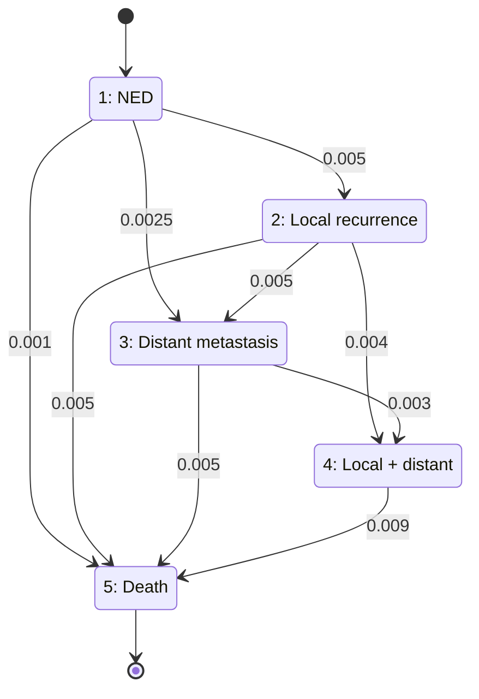

# The states of the model

The model follows a woman month by month after breast tumor surgery. At any
month she is in exactly one of 5 states.

| # | Name               | Meaning                                                  |
|---|--------------------|----------------------------------------------------------|
| 1 | NED                | No evidence of disease — cancer-free since surgery       |
| 2 | Local recurrence   | Cancer reappeared near the original surgery site         |
| 3 | Distant metastasis | Cancer reappeared elsewhere in the body                  |
| 4 | Local + distant    | Both local recurrence and distant metastasis present     |
| 5 | Death              | Absorbing — once reached, never left                     |

## Transition diagram

Edge labels are the monthly transition probabilities from `P` (self-loops,
i.e. "stay in the same state", are omitted for readability).

## Why state 4 is separate from 2 and 3

Health only gets worse in this model, never better. The allowed transitions
are 1→2, 1→3, 2→3, 2→4, 3→4, and any state →5. There is no direct 1→4
transition (`P[1,4] = 0`): a woman can only reach "both" by first having one
of local recurrence or distant metastasis, and then acquiring the other.

## State 5 is absorbing

Row 5 of `P` is `0, 0, 0, 0, 1` — death transitions to death with
probability 1. This is what makes simulation terminate: once a simulated
woman reaches state 5, she stays there, so we stop simulating her and record
the number of months it took as her lifetime.
